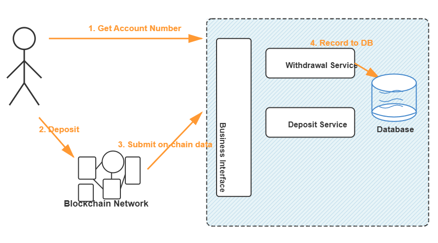
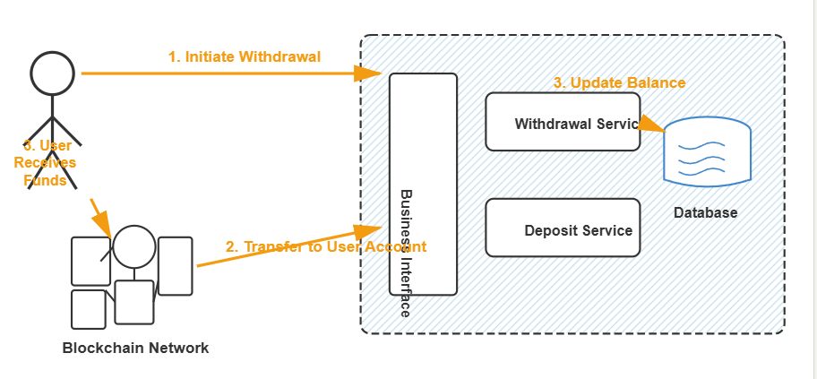
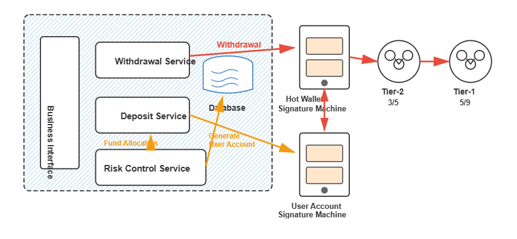
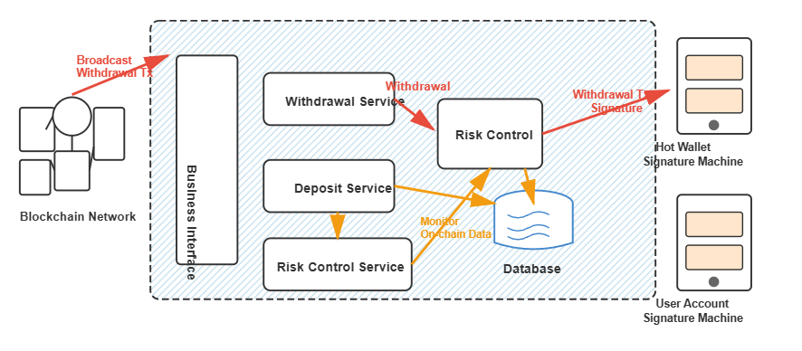
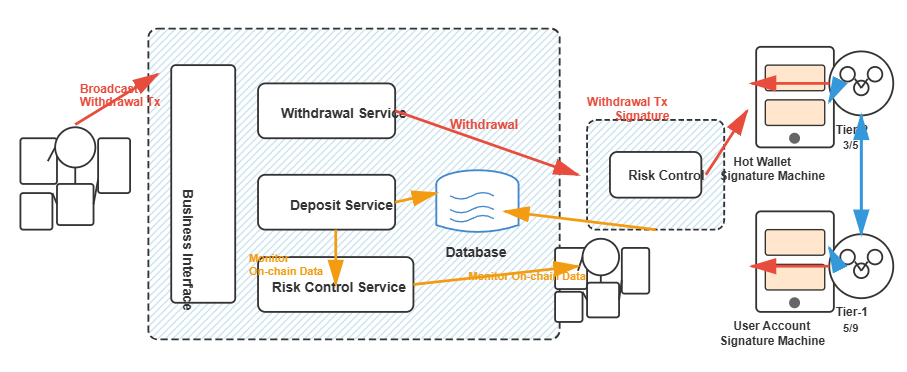

# Custodial Wallet System Explained

## What is an Custodial Wallet System?

Imagine you open an account at an exchange. The exchange needs to do three things for you:

1. **Generate a wallet address** - So you can deposit funds
2. **Track your balance** - The exchange keeps a record of how much money you have
3. **Help you transfer funds** - When you want to withdraw, the exchange transfers the money out for you

An exchange wallet system is the system that does these three things.

---

## Design 1: The Simplest Approach

### Components Needed

- **Deposit Service** = Continuously monitors the blockchain to see if users are depositing funds
- **Withdrawal Service** = Helps users transfer money out
- **Database** = Records how much money each user has
- **Business Interface** = Assigns wallet addresses to users and handles user requests

### User Deposit Flow



```
1️⃣ User asks the Business Interface: "Give me a wallet address"
   → Business Interface assigns an address to the user

2️⃣ User transfers 100 USDT to this address
   → Transaction is confirmed on the blockchain

3️⃣ Deposit Service detects this transaction
   → "Oh, this address belongs to User A, they deposited 100 USDT"

4️⃣ Deposit Service records this in the database
   → User A's balance = 100 USDT
```

**Key Point:** The Deposit Service continuously monitors the blockchain network. When it detects a transfer to a user's address, it immediately updates the balance in the database.

### User Withdrawal Flow



```
1️⃣ User initiates withdraw request through Business Interface
   → "I want to withdraw 50 USDT to my external address"

2️⃣ Withdrawal Service receives the request
   → Prepares a transfer transaction on blockchain

3️⃣ Withdrawal Service transfers from user's exchange account to user's blockchain address
   → Transaction is broadcast to blockchain network

4️⃣ User receives 50 USDT in their blockchain wallet
   → Database updates balance: User A's balance = 50 USDT
```

### The Problem ⚠️

**Private keys are stored directly in the database or application server!**

If a hacker compromises the database or server, they can steal all the private keys and transfer all the funds. This way is too dangerous!

---

## Design 2: Adding Signature Machine and Fund Allocation

### Core Concept

Don't store private keys in places that are easy to hack. Instead:

1. **Store private keys in an independent, offline secure machine** = Signature Machine
2. **Distribute funds across different wallets** = Hierarchical Fund Management

### Two New Components

#### 1. Signature Machine (The Vault)

```
Signature Machine = An independent, offline machine

What it does:
✅ Stores all private keys (like a vault)
✅ Only signs when needed
✅ Returns signed data after signing

Security features:
🔐 Offline → Hackers can't get in
🔐 Only signs → Even if compromised, can only sign, not transfer
🔐 Private keys never leave this machine
```

**Two Types of Signature Machines:**

- **Hot Wallet Signature Machine** - Handles withdrawals (warm storage)
- **User Account Signature Machine** - Generates user deposit addresses (cold storage)

#### 2. Fund Allocation Service (Automatic Money Mover)

```
What Fund Allocation Service does:
Continuously monitors how much money is in each wallet,
then automatically transfers funds from lower-tier wallets to higher-tier wallets.

Why do this:
💡 Risk diversification - Don't put all eggs in one basket
💡 Multi-party control - Higher-tier wallets require multiple people's approval
💡 Ensure liquidity - Lower-tier wallets always have funds available
```

### How Does Hierarchical Fund Management Work?

```
                    Tier-1 Wallet (Most Secure)
                    ↑ Requires 5/9 people to approve (Multi-sig)
                    |
        Transfer when balance > 3M USDT
                    |
                    Tier-2 Wallet (Very Secure)
                    ↑ Requires 3/5 people to approve (Multi-sig)
                    |
        Transfer when balance > 500K USDT
                    |
                  Hot Wallet (Relatively Secure)
                    ↑ Quick access, single signature
                    |
        Transfer when balance > 1000 USDT
                    |
                 User Account (Small Wallet)
                   (Entry Point)
```

**Simply put:** Money flows upward gradually as it comes in, with each higher tier being more secure. When funds are needed for withdrawals, they flow back down.

**Multi-signature wallets (3/5, 5/9)** means that multiple authorized people must approve a transaction before it can execute, adding an extra layer of security for large amounts.

### Complete Flow



#### User Account Creation

```
1. User requests deposit address through Business Interface
2. Business Interface calls User Account Signature Machine:
   "Generate a new account for this user"
3. User Account Signature Machine generates account address
4. Address is stored in database and returned to user
   (Note: Private key stays ONLY in Signature Machine, never in database)
```

#### User Deposit Flow

```
1. User gets assigned address → Makes transfer → Blockchain confirms
2. Deposit Service detects transaction on blockchain network
3. Deposit Service records balance in database
4. Fund Allocation Service monitors user account balance
   → When balance reaches 1000 USDT threshold
   → Automatically transfers to Hot Wallet (fund collection/consolidation)
5. When Hot Wallet exceeds 500K USDT → Transfer to Tier-2 Wallet
6. When Tier-2 exceeds 3M USDT → Transfer to Tier-1 Wallet
```

#### User Withdrawal Flow

```
1. User requests withdrawal through Business Interface
2. Withdrawal Service prepares transaction
3. Withdrawal Service requests Hot Wallet Signature Machine:
   "Sign this transfer transaction for me"
4. Hot Wallet Signature Machine signs with its private key
5. Withdrawal Service gets signature, broadcasts to blockchain
6. After blockchain confirmation, transfer completes
7. User receives funds in their external wallet
8. Database updates user balance
```

**Important:** The signature machines are isolated systems. They only sign transactions when requested - they never expose private keys and cannot be accessed directly from the internet.

---

## Design 3: Adding Risk Control (Preventing Money Laundering)

### New Problem

Even with Signature Machine and hierarchical funds, there's still a problem:

**Users might use the exchange for money laundering!**

```
A bad actor might do this:
1. Deposit dirty money (possibly illegal proceeds)
2. Immediately withdraw to a clean account
3. The dirty money is now "laundered" through the exchange
```

This puts the exchange at legal risk and violates anti-money laundering (AML) regulations.

### Solution: Risk Control Module

```
Risk Control Module = Blacklist Checking & AML Compliance System

Check during deposit:
"Where did this money come from?"
"Is the source address on any blacklist?"
"Is there suspicious activity pattern?"
"If flagged → Reject deposit or flag for review"
"If clean → Allow deposit"

Check during withdrawal:
"Where does the user want to transfer to?"
"Is the destination address blacklisted?"
"Is the amount suspicious?"
"If flagged → Reject withdrawal or require additional verification"
"If clean → Allow withdrawal"
```

**Risk Control checks against:**

- Known scam addresses
- Sanctioned addresses (OFAC lists)
- Addresses linked to hacks or exploits
- Addresses linked to mixers or tumblers
- Pattern analysis (suspicious behavior)

Note: KYC (Know Your Customer) verification is typically handled by specialized service providers and is a separate layer of compliance.

### The Flow Becomes



```
Deposit Flow:
User deposits → Deposit Service detects → Risk Control check
→ If OK, record in database → Fund Allocation monitors and transfers

Withdrawal Flow:
User initiates withdrawal → Risk Control check
→ If OK, request Hot Wallet Signature Machine
→ Sign transaction → Broadcast to blockchain → User receives funds
```

**Key Addition:** Risk Control now sits as a gatekeeper. No transaction (deposit or withdrawal) proceeds without passing risk control validation.

---

## Design 4: Independent Risk Control System (Most Secure Approach)

### Another New Problem

If the Risk Control module runs together with the business system, hackers who compromise the business system can bypass risk control by:

- Modifying risk control logic
- Disabling risk checks
- Manipulating data before it reaches risk control

**Solution:** Run risk control as a completely independent system with independent verification and monitoring of the blockchain.

### How Independent Risk Control Works

```
┌─────────────────────────────────────────────────┐
│ Independent Risk Control System                  │
├─────────────────────────────────────────────────┤
│ • Monitors blockchain independently             │
│ • Maintains its own database copy               │
│ • Cross-validates all transactions              │
│ • Cannot be bypassed by business system         │
│ • Has authority to reject transactions          │
└─────────────────────────────────────────────────┘
```

### Triple Verification Architecture

```
┌─────────────────────────────────────────┐
│ Withdrawal Flow with Triple Check       │
├─────────────────────────────────────────┤
│ 1️⃣ User initiates withdrawal via        │
│    Business Interface                   │
│    ↓                                     │
│ 2️⃣ Withdrawal Service prepares request  │
│    "User wants to withdraw 100 USDT"    │
│    ↓                                     │
│ 3️⃣ Independent Risk Control System      │
│    monitors blockchain and validates    │
│    "I independently verified this       │
│     transaction is legitimate"          │
│    ↓                                     │
│ 4️⃣ Only after Risk Control approval,    │
│    request sent to Signature Machine    │
│    "Sign with private key"              │
│    ↓                                     │
│ 5️⃣ With all verifications passed,       │
│    transaction executes                 │
│    → Transfer successful                │
└─────────────────────────────────────────┘
```

**Critical Security Feature:** The Independent Risk Control System:

- Monitors blockchain directly (not through business system)
- Maintains separate database for cross-validation
- Can detect if business system is compromised
- Must approve before signature machine will sign

**Benefit:** Even if hackers compromise the business system, they cannot:

- Bypass risk control checks
- Force signature machine to sign
- Manipulate the independent risk control database

To successfully attack, they'd need to compromise THREE independent systems simultaneously, which is nearly impossible.

### Complete Architecture Diagram



#### Module Responsibilities

| Module                       | Responsibility                | Authority                                                       |
| ---------------------------- | ----------------------------- | --------------------------------------------------------------- |
| **Business Interface**       | Handle user requests          | Receives requests, coordinates services                         |
| **Deposit Service**          | Monitor deposit transactions  | Can only write balance to DB after validation                   |
| **Withdrawal Service**       | Handle withdrawal requests    | Must pass risk control before requesting signing                |
| **Independent Risk Control** | Blacklist & AML checking      | Independent verification, monitors blockchain directly          |
| **Hot Wallet Signature**     | Sign withdrawal transactions  | Final gatekeeper for withdrawals                                |
| **User Account Signature**   | Generate deposit addresses    | Creates user deposit accounts                                   |
| **Fund Allocation Service**  | Automatic fund transfers      | Monitor balances, execute automatic tier transfers              |
| **Database**                 | Record all data               | Deposits write after validation, withdrawals only after signing |
| **Tier-2 Wallet (3/5)**      | Mid-tier secure storage       | Requires 3 out of 5 signatures to move funds                    |
| **Tier-1 Wallet (5/9)**      | Highest security cold storage | Requires 5 out of 9 signatures to move funds                    |

**Separation of Concerns:** Each module operates independently with clear boundaries. No single module has complete control over funds.

---

## Fund Flow Summary

### User Deposit (Complete Flow)

```
1. User receives deposit address from Business Interface
   (Generated by User Account Signature Machine)

2. User transfers funds to this address on blockchain

3. Blockchain confirms transaction

4. Deposit Service detects transaction by monitoring blockchain

5. Independent Risk Control System validates:
   ✓ Source address not blacklisted
   ✓ No suspicious patterns
   ✓ Complies with AML requirements

6. Risk Control approval → Record in database

7. Fund Allocation Service monitors balance
   → User account exceeds 1,000 USDT
   → Auto transfer to Hot Wallet (consolidation)

8. Hot Wallet exceeds 500K USDT
   → Transfer to Tier-2 Wallet (3/5 multi-sig)

9. Tier-2 exceeds 3M USDT
   → Transfer to Tier-1 Wallet (5/9 multi-sig)
```

### User Withdrawal (Complete Flow)

```
1. User initiates withdrawal request via Business Interface

2. Withdrawal Service receives request

3. Independent Risk Control System validates:
   ✓ Destination address not blacklisted
   ✓ User account has sufficient balance
   ✓ No suspicious withdrawal pattern
   ✓ Complies with AML requirements

4. Risk Control approval → Request sent to Hot Wallet Signature Machine

5. Hot Wallet Signature Machine signs transaction with private key

6. Withdrawal Service receives signed transaction

7. Broadcast transaction to blockchain network

8. Blockchain confirms transaction

9. User receives funds in external wallet

10. Database updates user balance
```

### Fund Allocation (Automated Process)

```
Upward Flow (Securing Profits):
Monitor user accounts → Over 1,000 USDT → Transfer to Hot Wallet
Monitor Hot Wallet → Over 500K USDT → Transfer to Tier-2 Wallet
Monitor Tier-2 Wallet → Over 3M USDT → Transfer to Tier-1 Wallet

Downward Flow (Ensuring Liquidity):
When Hot Wallet funds low → Request from Tier-2 (requires 3/5 approval)
When Tier-2 funds low → Request from Tier-1 (requires 5/9 approval)
```

**Automated Thresholds Prevent:**

- Hot wallet from holding too much (reduces hack risk)
- User accounts from accumulating (reduces sweep attack risk)
- Running out of liquidity for withdrawals (ensures availability)

---

## Core Security Principles

### 1. Decentralization (Distribution of Power)

- **Private keys distributed**
  - User Account Signature Machine (generates deposit addresses)
  - Hot Wallet Signature Machine (handles withdrawals)
  - Multi-sig wallets (Tier-2: 3/5, Tier-1: 5/9)
- **Funds distributed**
  - Multiple tiers of wallets
  - No single point of failure
  - Automatic rebalancing
- **Authority distributed**
  - Multiple systems must approve transfers
  - Higher tiers require multiple human approvals
  - No single person can move large funds

### 2. Isolation (Separation of Systems)

- **Business system separated from signature machines**
  - Signature machines are offline/air-gapped
  - Cannot be accessed directly from internet
  - Only communicate through secure channels
- **Risk control system runs independently**
  - Monitors blockchain directly
  - Maintains separate database
  - Cannot be manipulated by business logic
- **High-security wallets require manual approval**
  - Multi-signature prevents single point of compromise
  - Geographic distribution of key holders
  - Time-locked transactions for large amounts

### 3. Verification (Multiple Checks)

- **Deposit verification**
  - Source address validation
  - Blockchain confirmation
  - Risk control screening
  - Database cross-validation
- **Withdrawal verification**
  - Destination address validation
  - Balance verification
  - Risk control screening
  - Signature machine approval
- **Independent monitoring**
  - Risk control monitors independently
  - Fund allocation monitors automatically
  - Alert systems for anomalies

### 4. Defense in Depth (Layered Security)

```
Layer 1: Network Security
  └─ Firewalls, DDoS protection, intrusion detection

Layer 2: Application Security
  └─ Input validation, rate limiting, authentication

Layer 3: Risk Control
  └─ AML checks, blacklist validation, pattern detection

Layer 4: Signature Machines
  └─ Offline storage, secure signing, key isolation

Layer 5: Multi-signature
  └─ Multiple approvals, geographic distribution

Layer 6: Monitoring & Alerts
  └─ Real-time monitoring, anomaly detection, incident response
```

---

## Why So Complex?

You might ask: "Why can't it be simpler?"

**Because:**

- 🔐 **Security** - If one point fails, the entire system could be compromised
  - Examples: Mt. Gox (2014, $450M lost), Coincheck (2018, $530M lost)
- 💰 **Large Fund Volume** - Exchanges manage billions in user funds
  - Top exchanges hold $10B+ in assets
  - Single breach = catastrophic losses
- 🎯 **High Risk** - Exchanges are prime targets for hackers
  - Sophisticated attackers with advanced techniques
  - State-sponsored attacks, organized crime
  - Constant probing for vulnerabilities
- ⚖️ **Regulatory Compliance** - Must prevent money laundering and illegal activities

  - FATF guidelines
  - Local AML/KYC regulations
  - Sanctions compliance (OFAC)
  - Legal liability for facilitating crime

- 👥 **User Trust** - Users entrust their money to the exchange
  - Loss of funds = loss of trust
  - Reputation damage is permanent
  - Competitive disadvantage

Every layer of defense is necessary and serves a specific purpose:

| Defense Layer            | Protects Against             | Example Threat                       |
| ------------------------ | ---------------------------- | ------------------------------------ |
| Signature Machine        | Private key theft            | Database breach, server compromise   |
| Hierarchical Funds       | Single point of failure      | Hot wallet attack, insider theft     |
| Risk Control             | Money laundering, fraud      | Dirty money, scam victims            |
| Independent Verification | Business logic manipulation  | Compromised servers, rogue employees |
| Multi-signature          | Unauthorized large transfers | Single key holder compromise         |
| Monitoring & Alerts      | Anomalous behavior           | Unusual patterns, slow attacks       |

---

## Real-World Example: A Day in the Life

Let's walk through a typical scenario:

### Morning: User Alice Deposits

```
09:00 AM - Alice sends 2,000 USDT from her MetaMask wallet
09:02 AM - Blockchain confirms transaction (12 confirmations)
09:02 AM - Deposit Service detects: "2,000 USDT to Alice's address"
09:02 AM - Risk Control checks:
           ✓ Source address clean
           ✓ No suspicious patterns
           ✓ Amount within normal range
09:02 AM - Database updated: Alice balance = 2,000 USDT
09:05 AM - Fund Allocation detects: "Alice's account > 1,000 USDT"
09:05 AM - Automatic transfer: 2,000 USDT → Hot Wallet
09:05 AM - Alice sees deposit confirmed in her exchange account
```

### Afternoon: User Bob Withdraws

```
02:30 PM - Bob requests withdrawal: 500 USDT to his hardware wallet
02:30 PM - Risk Control validates:
           ✓ Bob's destination address clean
           ✓ Bob has sufficient balance (1,200 USDT)
           ✓ No recent suspicious activity
02:30 PM - Risk Control approves
02:31 PM - Withdrawal Service requests Hot Wallet Signature Machine
02:31 PM - Signature Machine signs transaction
02:31 PM - Transaction broadcast to blockchain
02:35 PM - Blockchain confirms (12 confirmations)
02:35 PM - Bob receives 500 USDT in his hardware wallet
02:35 PM - Database updated: Bob balance = 700 USDT
```

### Evening: Fund Allocation

```
08:00 PM - Fund Allocation checks Hot Wallet: 550,000 USDT
08:00 PM - Threshold exceeded (> 500K)
08:01 PM - Prepares transfer to Tier-2 Wallet
08:01 PM - Requests 3/5 multi-sig approvals
08:15 PM - 3 key holders approve transaction
08:16 PM - Transfer executed: 300,000 USDT → Tier-2 Wallet
08:16 PM - Hot Wallet balance: 250,000 USDT (maintaining liquidity)
```

### Night: Security Monitoring

```
11:45 PM - Risk Control detects: Multiple small deposits from same source
11:45 PM - Pattern flagged as potential "structuring" (avoiding limits)
11:46 PM - Automatic hold placed on account
11:46 PM - Alert sent to compliance team
11:47 PM - Account flagged for review next business day
```

---

## Common Questions

### Q: Why not just use one cold wallet for everything?

**A:** While maximum security, it would be impractical:

- ❌ Slow withdrawals (need to access cold storage each time)
- ❌ Poor user experience (hours/days for withdrawal)
- ❌ Single point of failure (if compromised, everything lost)
- ❌ Operational bottleneck (limited throughput)

Hierarchical design balances security with usability.

### Q: What if the Hot Wallet Signature Machine is hacked?

**A:** Limited damage due to:

- ✅ Hot wallet holds only small percentage of total funds
- ✅ Automatic fund allocation limits exposure
- ✅ Real-time monitoring detects abnormal activity
- ✅ Can freeze withdrawals immediately
- ✅ Most funds safely in Tier-2 and Tier-1

Maximum loss is limited to hot wallet balance (typically < 5% of total).

### Q: Why do we need both business risk control AND independent risk control?

**A:** Defense in depth:

- Business risk control = First line of defense (fast, integrated)
- Independent risk control = Second line (cannot be bypassed, validates)

If business system is compromised, independent risk control still protects.

### Q: What happens if key holders for multi-sig are unavailable?

**A:** Redundancy built in:

- Tier-2 (3/5): Only need 3 out of 5 people
- Tier-1 (5/9): Only need 5 out of 9 people
- Key holders in different time zones
- Clear succession procedures
- Emergency protocols for urgent situations

### Q: How fast are withdrawals?

**A:** Typical withdrawal timeline:

```
Instant    - Request validation (< 1 second)
Instant    - Risk control check (< 1 second)
Instant    - Signature generation (< 1 second)
1-5 min    - Blockchain confirmation (varies by network)
Total: Usually under 5 minutes for normal withdrawals
```

Large withdrawals may require additional verification (hours).

---

## Summary

### The Four-Layer Defense

```
Layer 1: Signature Machine (Physical Security)
 └─ Private keys never exposed
 └─ Offline/air-gapped storage
 └─ Secure signing only

Layer 2: Hierarchical Funds (Distribution)
 └─ Hot Wallet (fast access, small amounts)
 └─ Tier-2 Wallet (3/5 multi-sig, medium security)
 └─ Tier-1 Wallet (5/9 multi-sig, maximum security)

Layer 3: Risk Control (Compliance & Fraud Prevention)
 └─ Blacklist checking
 └─ AML compliance
 └─ Pattern detection

Layer 4: Independent Verification (Redundancy)
 └─ Multiple systems must agree
 └─ Cross-validation
 └─ Cannot be bypassed
```

### Key Takeaways

1. **Never trust a single system** - Always have redundancy
2. **Distribute everything** - Keys, funds, authority
3. **Isolate critical components** - Signature machines, risk control
4. **Monitor continuously** - Real-time detection and alerts
5. **Assume breach** - Design to limit damage even if compromised

### Final Thought

Building a secure exchange wallet system is like building a bank vault:

- You don't just need a strong door (signature machine)
- You need multiple doors (hierarchical wallets)
- You need guards checking everyone (risk control)
- You need independent auditors (independent verification)
- You need cameras everywhere (monitoring)
- You need alarms for unusual activity (alerts)

**Each component serves a critical purpose. Remove any one, and security is compromised.**

---

## Further Reading

- [Bitcoin Multi-signature Wallets](https://en.bitcoin.it/wiki/Multi-signature)
- [FATF Guidance for Virtual Assets](https://www.fatf-gafi.org/publications/fatfrecommendations/documents/guidance-rba-virtual-assets.html)
- [Cryptocurrency Security Standard (CCSS)](https://cryptoconsortium.github.io/CCSS/)
- [Best Practices for Exchange Security](https://blog.coinbase.com/how-coinbase-builds-secure-infrastructure-94aa662e2f45)

---

_This document provides a high-level overview of exchange wallet system design. Actual implementations may vary based on specific requirements, regulatory environment, and risk tolerance._
