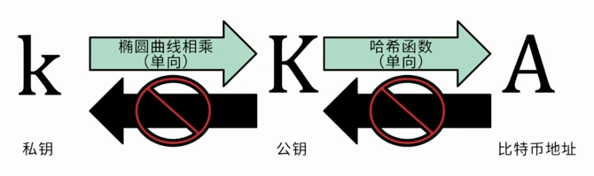
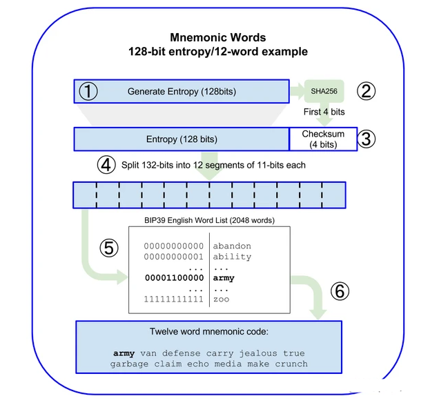
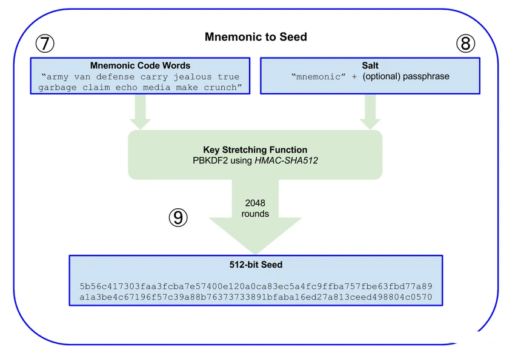
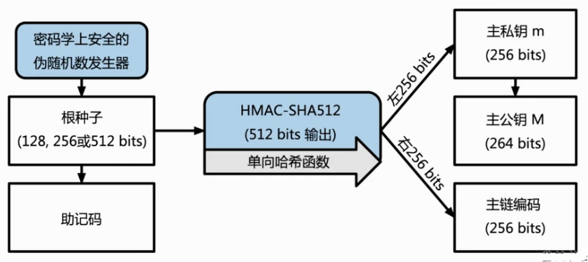

# BIP32, BIP39, BIP44: Hierarchical Deterministic Wallets

## The Core Problem

Managing 1 million users requires generating 1 million wallet addresses.

**Naive approach:** One private key per user = 1 million keys to backup

**Smart approach:** One seed generates all private keys

This is what **BIP32 / BIP39 / BIP44** solve.

---

## BIP32: Hierarchical Deterministic Wallets

### The Problem

How to derive unlimited private keys from a single seed?

### The Solution: Tree Structure

```
Seed (512 bits)
    ↓ [HMAC-SHA512]
Master Private Key (km) + Master Chain Code
    ↓
├─ Child Key k0 (index 0)
│  ├─ Grandchild k0/0
│  ├─ Grandchild k0/1
│  └─ Grandchild k0/2
├─ Child Key k1 (index 1)
│  ├─ Grandchild k1/0
│  └─ ...
└─ Child Key k2 (index 2)
   └─ ...
```

### Derivation Process

**Inputs:**

- Parent Private Key (256 bits)
- Parent Chain Code (256 bits)
- Index (32 bits)

**Process:**

```
[HMAC-SHA512] → 512-bit output
    ↓
Split into:
├─ Left 256 bits → Child Private Key
└─ Right 256 bits → Child Chain Code
```



### Two Derivation Modes

| Mode     | Index Range    | Derivation              | Security     |
| -------- | -------------- | ----------------------- | ------------ |
| Normal   | 0 ～ 2^31-1    | From parent public key  | Standard     |
| Hardened | 2^31 ～ 2^32-1 | From parent private key | **Enhanced** |

Hardened derivation (marked with `'`) cannot be derived from public keys alone.

### Key Properties

✅ **Deterministic:** Same input always produces same output  
✅ **One-way:** Child keys cannot derive parent keys  
✅ **Isolated:** Sibling keys cannot derive each other  
✅ **Unlimited:** Infinite keys can be generated

---

## BIP39: Mnemonic Seeds

### The Problem

A 512-bit seed is a binary string—users cannot memorize or safely back it up.

```
Seed: 0110101010001101010...512 bits
User: ???
```

### The Solution: 12 Words

```
Mnemonic: candy maple cake sugar pudding cream honey rich
          smooth crumble sweet treat
```

Much easier to backup and remember.

### Generating the Mnemonic



**Process:**

1. Generate 128-bit random entropy
2. Calculate checksum (first 4 bits of SHA256)
3. Combine: 128 + 4 = 132 bits
4. Split into 12 segments of 11 bits each
5. Map each segment (0-2047) to BIP39 wordlist
6. Result: 12 mnemonic words

### Converting Mnemonic to Seed



**Inputs:**

- Mnemonic words
- Salt: "mnemonic" + optional password

**Process:**

```
PBKDF2(Mnemonic + Salt, 2048 rounds, HMAC-SHA512)
    ↓
512-bit Seed
```

### Password Security

```
Same mnemonic + Different password = Different seed = Different accounts
```

Example:

```
Mnemonic: "candy maple cake sugar..."
+ Password: "" → Seed A → Account A
+ Password: "pass1" → Seed B → Account B
+ Password: "pass2" → Seed C → Account C
```

Even if an attacker obtains the mnemonic, without the password they cannot recover accounts.

---

## BIP44: Standard Derivation Paths

### The Problem

Without a standard path convention, different wallets use different routes to derive addresses. Same mnemonic produces different accounts in different wallets—incompatible.

### The Solution: Unified 5-Layer Structure



```
m / purpose' / coin' / account' / change / address_index
```

### Layer Breakdown

**Layer 1: purpose' (Fixed: 44')**

```
Indicates BIP44 standard compliance
Must use hardened derivation (')
```

**Layer 2: coin' (Coin Type)**

| Coin            | Code    | Path              |
| --------------- | ------- | ----------------- |
| Bitcoin         | 0'      | m/44'/0'/...      |
| Bitcoin Testnet | 1'      | m/44'/1'/...      |
| **Ethereum**    | **60'** | **m/44'/60'/...** |
| Litecoin        | 2'      | m/44'/2'/...      |
| Solana          | 501'    | m/44'/501'/...    |

Full list: https://github.com/satoshilabs/slips/blob/master/slip-0044.md

**Layer 3: account' (Account Index)**

```
m/44'/60'/0' ← Account 0
m/44'/60'/1' ← Account 1
m/44'/60'/2' ← Account 2
```

**Layer 4: change (Address Type)**

```
m/44'/60'/0'/0 ← External (Receive Address)
m/44'/60'/0'/1 ← Internal (Change Address)
```

**Layer 5: address_index (Address Sequence)**

```
m/44'/60'/0'/0/0 ← 1st address
m/44'/60'/0'/0/1 ← 2nd address
m/44'/60'/0'/0/2 ← 3rd address
```

### Ethereum Example

```
Path: m/44'/60'/0'/0/0
      ├─ 44' = BIP44 standard
      ├─ 60' = Ethereum
      ├─ 0' = Account 0
      ├─ 0 = Receive address
      └─ 0 = 1st address

Result:
Private Key: 0x1a2b3c4d5e6f7a8b9c0d1e2f3a4b5c6d...
Address: 0x5aAeb6053ba3EFa8899CbEaF830d8fd7c054f90b
```

---

## Complete Flow: Mnemonic to Address

```
Step 1: Generate/Import Mnemonic
"candy maple cake sugar pudding cream honey rich..."
    ↓ [BIP39]

Step 2: Mnemonic + Password → Seed
Using PBKDF2 (2048 iterations)
    ↓

Step 3: Seed → Master Private Key
Using HMAC-SHA512
    ↓ [BIP32]

Step 4: Derive Along Path
m/44'/60'/0'/0/0
Each level: HMAC-SHA512
    ↓

Step 5: Private Key → Public Key
Using Elliptic Curve (secp256k1)
    ↓

Step 6: Public Key → Address
Using Keccak256 Hash
    ↓

Step 7: Final Address (EIP-55 Checksum)
0x5aAeb6053ba3EFa8899CbEaF830d8fd7c054f90b
```

---

## Why All Three Are Needed

### BIP32 Only

❌ No path standard → wallets incompatible  
❌ Addresses differ across applications

### BIP32 + BIP44

✅ Paths standardized  
✅ Multi-coin support  
❌ Still difficult for users to backup seed

### BIP32 + BIP39

✅ Easy mnemonic backup  
❌ Paths remain non-standard

### BIP32 + BIP39 + BIP44

✅ **Complete solution**

- **BIP39:** Mnemonic generation and recovery
- **BIP32:** Hierarchical private key derivation
- **BIP44:** Standard path specification

All major wallets (MetaMask, Ledger, Trust Wallet, etc.) use this standard.

---

## Exchange Implementation

```
User Registration
    ↓
Assign derivation path: m/44'/60'/0'/0/{n}
    ↓
Signer derives private key from path
    ↓
Generate public key → address
    ↓
Database stores: user_id, address, path
(Private key NEVER stored)
    ↓
User receives deposits
    ↓
User withdraws:
  1. Look up path in database
  2. Re-derive private key
  3. Sign transaction with private key
  4. Return signed transaction
  5. Broadcast to blockchain
```

---

## Security Principles

| Principle                       | Reason                                |
| ------------------------------- | ------------------------------------- |
| Private key never stored        | Prevents attacker access              |
| Path + Password enable recovery | Dynamic generation, no storage needed |
| Mnemonic stored offline         | Prevents hacking if stolen            |
| Complex password                | Resists brute force attacks           |
| Signer on internal network      | Blocks external attacks               |

---

## FAQ

**Q: Why hardened derivation?**  
A: Uses parent private key. Even if parent public key is compromised, child keys cannot be derived.

**Q: Forgot the password?**  
A: Cannot recover. Password must be memorized or securely backed up separately from mnemonic.

**Q: How many accounts per user?**  
A: Unlimited. Change `account'` to create new accounts, all controlled by one mnemonic.

**Q: Can Bitcoin and Ethereum addresses be mixed?**  
A: No. Different `coin_type` values produce incompatible addresses on different blockchains.

**Q: Same mnemonic, different wallets?**  
A: Same addresses. All wallets follow BIP44 standard.
