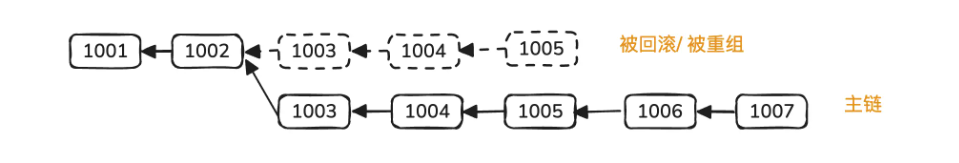
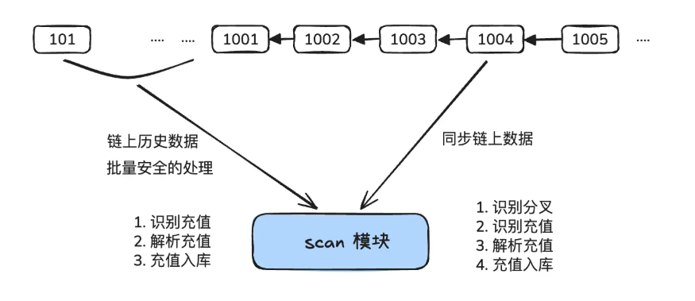
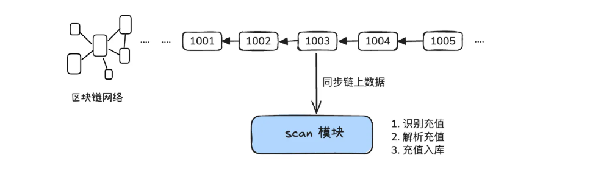

# Processing User Deposits in Exchange Wallets

## I. Identifying Deposit Transactions

### Native Token Deposits (ETH)

Users transfer directly to our wallet address. The transaction structure is straightforward:

```
from: User address
to: Our wallet address  ← This is the key!
amount: ETH quantity
```

**Identification**: Check if the transaction's `to` address matches one of our generated user addresses.

**Important Notes**:

- If a user transfers through a contract, the `to` becomes a contract address. Use `debug_traceTransaction` to trace internal calls (requires self-hosted node)
- Block rewards cannot be identified (system rewards, not transactions)

---

### ERC20 Token Deposits

Users invoke the Token contract's `transfer()` function:

```
from: User address
to: ERC20 contract address  ← NOT the user!
input: transfer(user_address, amount)  ← Real transfer is here
```

**Identification**: Parse `Transfer` event logs instead of transactions.

Each ERC20 transfer generates an event with:

```
topics[0] = keccak256(Transfer(address,address,uint256))
           = 0xddf252ad1be2c89b69c2b068fc378daa952ba7f163c4a11628f55a4df523b3ef

topics[1] = from address (sender)
topics[2] = to address (receiver)  ← Match our user addresses
data = transfer amount
log.address = Token contract address  ← Match supported tokens
```

**Key Optimization**: Use Bloom Filters for batch queries

```javascript
// Query multiple tokens and users in one call
const logs = await getLogs({
  address: [USDT, USDC, DAI, ...],  // All token contracts
  topics: [
    transferTopic,              // Fixed
    null,                       // Don't filter sender
    [userAddr1, userAddr2, ...] // Filter receivers
  ]
});
```

**Risk Mitigation**:

- Prevent malicious tokens with false events (require open-source + audit)
- Fee-on-transfer tokens deduct fees during transfer; use `balanceOf()` to verify final balance

---

## II. Handling Blockchain Forks

### What is a Fork?

Distributed blockchains occasionally fork:

- One branch gets rolled back
- Another becomes the main chain
- Transactions on the rolled-back branch are reversed

### Two Approaches

#### Approach 1: Wait for Finality (Safe but Slow)

Only process `finalized` blocks, which can never be rolled back.

- **Ethereum**: Finalized after 2 epochs (~6 minutes)
- **Bitcoin**: After 6 additional blocks (~1 hour)

Drawback: Users wait a long time to see deposits confirmed.

#### Approach 2: Real-Time Processing + Fork Rollback (Industry Standard)

Process transactions in real-time and auto-rollback when forks are detected.

**Fork Detection**:



When you detect:

- Same block height but different hash, OR
- Different parent hash at the same height

→ Roll back to the common ancestor and re-scan

---

## III. Complete Block Scanning Flow

### On Startup

1. Read the last scanned block height from database
2. Fetch current chain height from RPC

### Scanning Process



**Algorithm**:

```
1. For old, finalized blocks:
   - Batch scan and parse into database

2. For recent blocks:
   - Check for forks first
   - If fork detected, rollback to common ancestor
   - Re-scan from ancestor onwards

3. Continue until caught up to latest block
```

---

## IV. Database Schema

### 1. Blocks Table

Records scanning progress and enables fork detection.

| Field       | Type    | Description              |
| ----------- | ------- | ------------------------ |
| hash        | TEXT    | Block hash (primary key) |
| parent_hash | TEXT    | Parent block hash        |
| number      | INTEGER | Block number             |
| timestamp   | INTEGER | Block timestamp          |
| status      | TEXT    | confirmed / orphaned     |

### 2. Transactions Table

Records identified deposits.

| Field              | Type    | Description                             |
| ------------------ | ------- | --------------------------------------- |
| tx_hash            | TEXT    | Transaction hash (unique)               |
| block_hash         | TEXT    | Containing block                        |
| from_addr          | TEXT    | Sender address                          |
| to_addr            | TEXT    | Recipient address                       |
| token_addr         | TEXT    | Token contract (NULL for native tokens) |
| amount             | TEXT    | Amount (string to avoid precision loss) |
| type               | TEXT    | deposit/withdraw/collect/rebalance      |
| status             | TEXT    | confirmed/safe/finalized/failed         |
| confirmation_count | INTEGER | Number of confirmations                 |

### 3. Tokens Table

Global registry of all supported tokens.

| Field         | Type    | Description                        |
| ------------- | ------- | ---------------------------------- |
| chain_type    | TEXT    | eth/polygon/bsc/solana etc.        |
| chain_id      | INTEGER | Chain ID (1, 137, 56, etc.)        |
| token_address | TEXT    | Contract address (NULL for native) |
| token_symbol  | TEXT    | ETH/USDT/USDC                      |
| decimals      | INTEGER | Decimal places (default 18)        |
| is_native     | BOOLEAN | Is native token                    |
| status        | INTEGER | 0-disabled / 1-enabled             |

---

## V. User Balance Handling

### ❌ Approach 1: Balance Table (Not Recommended)

```
Each transaction → Update balance field directly
```

Problems:

- Cannot reconcile; transactions don't match balances
- Transaction replay → Balance corruption
- Finalized transaction rollback → Unrecoverable

### ✅ Approach 2: Ledger Table (Recommended)

Create a **Credits (Ledger) Table** where each row represents a fund movement:

| Field        | Type    | Description                              |
| ------------ | ------- | ---------------------------------------- |
| id           | INTEGER | Auto-increment primary key               |
| user_id      | INTEGER | User ID                                  |
| token_id     | INTEGER | Reference to tokens table                |
| amount       | TEXT    | Amount (positive=credit, negative=debit) |
| credit_type  | TEXT    | deposit/withdraw/trade_buy/trade_sell    |
| status       | TEXT    | pending/confirmed/finalized              |
| tx_hash      | TEXT    | Transaction hash                         |
| reference_id | TEXT    | Associated business ID (for idempotency) |
| event_index  | INTEGER | Log index in block                       |

**Critical Constraint**:

```sql
UNIQUE(reference_id, reference_type, event_index)
```

Prevents transaction replay.

### Querying User Balance

Create an aggregation view:

```sql
CREATE VIEW v_user_token_totals AS
SELECT
  c.user_id,
  c.token_id,
  c.token_symbol,
  t.decimals,
  SUM(CASE
    WHEN c.status = 'finalized'
    THEN CAST(c.amount AS REAL)
    ELSE 0
  END) as total_balance,
  PRINTF('%.6f', SUM(CASE
    WHEN c.status = 'finalized'
    THEN CAST(c.amount AS REAL)
    ELSE 0
  END) / POWER(10, t.decimals)) as total_balance_formatted
FROM credits c
JOIN tokens t ON c.token_id = t.id
GROUP BY c.user_id, c.token_id
HAVING total_balance > 0;
```

**Advantages**:

- ✅ Fully auditable; every transaction is traceable
- ✅ Idempotent; prevents duplicates
- ✅ Supports complex operations (trading, internal transfers)
- ✅ Fork rollback: just delete related ledger entries and recalculate

---

## VI. Architecture Overview



The Scan module:

- Fetches blocks from blockchain network
- Processes historical data securely
- Identifies and parses deposits
- Stores into database

---

## VII. Key Takeaways

| Challenge                        | Solution                                                |
| -------------------------------- | ------------------------------------------------------- |
| Identify ETH deposits?           | Check if `to` == user address                           |
| Identify ERC20 deposits?         | Parse `Transfer` events + Bloom filters                 |
| Handle blockchain forks?         | Real-time processing + fork detection + DB rollback     |
| Ensure reconciliation?           | Use ledger table + uniqueness constraints (idempotency) |
| Query user balances efficiently? | Aggregation view with SUM operation                     |
| Prevent duplicates?              | reference_id deduplication + status tracking            |

---
