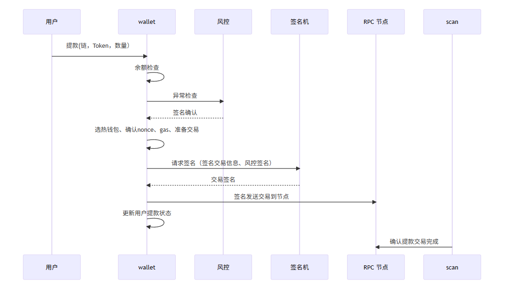

# User Withdrawal Processing

## I. Withdrawal Flow

The complete withdrawal process consists of the following steps:

1. User initiates withdrawal request
2. System validates sufficient balance and minimum withdrawal amount
3. Risk control checks for anomalies (suspicious addresses, withdrawal limits)
4. Select an available hot wallet for the transfer
5. Request signature from the signing machine
6. Broadcast signed transaction to blockchain
7. Update user and hot wallet balances
8. Confirm withdrawal completion

**Sequence Diagram**:



The flow involves:

1. User submits withdrawal request (chain, token, amount)
2. Wallet performs balance check
3. Risk control performs anomaly detection
4. Wallet selects hot wallet, determines nonce, gas, and prepares transaction
5. Request signature from signing machine (transaction data + risk control approval)
6. Signing machine returns signed transaction
7. Wallet broadcasts signed transaction to RPC node
8. RPC node broadcasts to blockchain network
9. Scan module monitors and confirms completion

---

## II. Hot Wallet Management

### Why Multiple Hot Wallets?

- **Single hot wallet**: Transactions queue up, slower processing
- **Multiple hot wallets**: Load balancing, faster execution

### Database Design

Extend the `wallets` table with a `wallet_type` field:

| Field       | Type     | Description                          |
| ----------- | -------- | ------------------------------------ |
| id          | INTEGER  | Primary key                          |
| user_id     | INTEGER  | User ID (foreign key)                |
| address     | TEXT     | Wallet address (unique)              |
| device      | TEXT     | Signing device address               |
| path        | TEXT     | Derivation path                      |
| chain_type  | TEXT     | evm / btc / solana                   |
| wallet_type | TEXT     | user / hot / cold / multisig / vault |
| is_active   | INTEGER  | 0-inactive / 1-active                |
| created_at  | DATETIME | Creation timestamp                   |
| updated_at  | DATETIME | Update timestamp                     |

### Selection Strategy

- **Select criteria**: Hot wallet with sufficient balance
- **Round-robin**: Prioritize least recently used wallet
- **Benefit**: Avoids congestion on a single wallet and distributes nonce usage evenly

---

## III. Nonce Management (Critical)

### What is Nonce?

Nonce is the transaction sequence number for an account. Transactions must execute in order:

```
Transaction 1: nonce = 0  ✓ Executes
Transaction 2: nonce = 1  ✓ Executes
Transaction 3: nonce = 2  ✓ Executes
```

### The Nonce Gap Problem

If transaction with nonce 4 fails, transaction with nonce 5 **gets stuck** in the mempool—even with high fees. This is called a "nonce gap."

**Only transactions with matching nonce values execute in strict order.**


In the diagram:

- Transactions 1-3 execute successfully with nonces 0-2
- Transaction 4 (nonce=3) fails or is delayed
- Transaction 5 (nonce=4) waits in mempool, cannot execute
- If another transaction 6 (nonce=5) is sent, it also waits
- The green transaction shows what would execute once transaction 4 succeeds

### Database Management

Create a `wallet_nonces` table:

| Field        | Type     | Description             |
| ------------ | -------- | ----------------------- |
| id           | INTEGER  | Primary key             |
| wallet_id    | INTEGER  | Reference to wallets.id |
| chain_id     | INTEGER  | Chain ID                |
| nonce        | INTEGER  | Current nonce value     |
| last_used_at | DATETIME | Last usage timestamp    |
| created_at   | DATETIME | Creation timestamp      |
| updated_at   | DATETIME | Update timestamp        |

### Implementation Steps

1. **Initialize**: Fetch current nonce from blockchain using `eth_getTransactionCount(address, "pending")`
2. **On withdrawal**: Increment nonce by 1 in database, update `last_used_at`
3. **Next selection**: Choose wallet with oldest `last_used_at` (round-robin)

This ensures proper sequencing and prevents nonce gaps across multiple concurrent withdrawals.

---

## IV. Withdrawal Fee Configuration

### Fixed Withdrawal Fee

Extend the `tokens` table with fee and minimum amount fields:

| Field                   | Type    | Description                           |
| ----------------------- | ------- | ------------------------------------- |
| id                      | INTEGER | Primary key                           |
| chain_type              | TEXT    | eth / btc / solana etc.               |
| chain_id                | INTEGER | Chain ID                              |
| token_address           | TEXT    | Contract address (NULL for native)    |
| token_symbol            | TEXT    | ETH / USDC / USDT                     |
| token_name              | TEXT    | Full name                             |
| decimals                | INTEGER | Decimal places                        |
| is_native               | BOOLEAN | Is native token                       |
| collect_amount          | TEXT    | Collection threshold                  |
| **withdraw_fee**        | TEXT    | Fixed withdrawal fee (wei units)      |
| **min_withdraw_amount** | TEXT    | Minimum withdrawal amount (wei units) |
| status                  | INTEGER | 0-disabled / 1-enabled                |

### Example Configuration

- USDC withdrawal fee: 0.5 USDC
- Minimum withdrawal: 5 USDC
- User withdraws 100 USDC → Actual transfer: 99.5 USDC

**Benefits**:

- User predictability
- Simplified operations
- Additional revenue for exchange

---

## V. Dynamic Gas Fee Strategy

### EIP-1559 Fee Calculation

```
Transaction Fee = gasLimit × (baseFeePerGas + priorityFeePerGas)
```

Three key parameters:

| Parameter         | Description                    | Example      |
| ----------------- | ------------------------------ | ------------ |
| gasLimit          | Max gas units for transaction  | 21,000 (ETH) |
| baseFeePerGas     | Network base fee (protocol)    | 50 Gwei      |
| priorityFeePerGas | Tip to miners (miner priority) | 2 Gwei       |

### Setting Parameters

**Recommended approach**:

1. **gasLimit**: Fixed value per token (configure in `tokens` table)
2. **baseFeePerGas**: Use latest block's baseFee
3. **priorityFeePerGas**: Use 70th percentile of last 20 blocks' priority fees
4. **maxFeePerGas**: `baseFeePerGas × 2 + priorityFeePerGas`

**Pseudocode**:

```javascript
// Fetch recent fee history
const feeHistory = await rpc.eth_feeHistory(20, "latest");

// Calculate base fee
const baseFeePerGas =
  feeHistory.baseFeePerGas[feeHistory.baseFeePerGas.length - 1];

// Calculate priority fee (70th percentile)
const priorityFees = feeHistory.reward.map((r) => r[4]); // 70th percentile
const priorityFeePerGas = median(priorityFees);

// Set max fee with 20% buffer
const maxFeePerGas = baseFeePerGas * 2 + priorityFeePerGas;

// Create transaction
const tx = {
  to: recipientAddress,
  gas: 21000,
  maxFeePerGas,
  maxPriorityFeePerGas: priorityFeePerGas,
  nonce: currentNonce,
  chainId,
};

// Sign and broadcast
const signedTx = account.signTransaction(tx);
await rpc.eth_sendRawTransaction(signedTx);
```

**Advantages**:

- Adapts to network conditions
- Avoids overpaying during low congestion
- Ensures timely confirmation during high demand
- 20% buffer handles short-term spikes

---

## VI. Withdrawal Record Schema

### Withdraws Table

| Field                    | Type     | Description                         |
| ------------------------ | -------- | ----------------------------------- |
| id                       | INTEGER  | Primary key                         |
| user_id                  | INTEGER  | User ID (foreign key)               |
| from_address             | TEXT     | Hot wallet address                  |
| to_address               | TEXT     | Recipient address                   |
| token_id                 | INTEGER  | Token ID (foreign key)              |
| amount                   | TEXT     | Withdrawal amount (wei)             |
| fee                      | TEXT     | Fixed withdrawal fee (wei)          |
| chain_id                 | INTEGER  | Chain ID                            |
| chain_type               | TEXT     | evm / btc / solana                  |
| status                   | TEXT     | State in withdrawal lifecycle       |
| tx_hash                  | TEXT     | Transaction hash (after signing)    |
| nonce                    | INTEGER  | Transaction nonce (after signing)   |
| gas_used                 | TEXT     | Actual gas consumed (after confirm) |
| gas_price                | TEXT     | Gas price (legacy transactions)     |
| max_fee_per_gas          | TEXT     | Max fee (EIP-1559)                  |
| max_priority_fee_per_gas | TEXT     | Priority fee (EIP-1559)             |
| error_message            | TEXT     | Error details (if failed)           |
| created_at               | DATETIME | Creation timestamp                  |
| updated_at               | DATETIME | Update timestamp                    |

### Status Lifecycle

```
user_withdraw_request
        ↓
      signing (awaiting signature)
        ↓
      pending (submitted to network)
        ↓
    processing (in mempool)
        ↓
    confirmed (on blockchain)
```

If error occurs:

```
failed + error_message
```

### Ledger Integration

When processing withdrawal, create two records in the `credits` (ledger) table:

1. **User record**: `amount = -(withdrawal_amount + fee)` (debit)
2. **Hot wallet record**: `amount = -withdrawal_amount` (debit for transfer)

Both with:

- `reference_id`: withdraws.id
- `status`: matches withdrawal status
- `tx_hash`: same transaction hash

This enables accurate balance reconciliation through ledger aggregation.

---

## VII. Batch Withdrawal Optimization

### Problem with Standard Approach

Each transaction from an EOA (externally owned account) hot wallet costs 21,000 gas base fee, even for simple transfers.

Processing 100 withdrawals sequentially:

- 100 transactions × 21,000 gas = 2.1M gas (expensive!)

### Solutions

#### Solution 1: EIP-7702 Smart Accounts

- Convert standard EOA to smart account
- Supports batch transactions natively
- Significantly reduces gas overhead

#### Solution 2: Vault Contract

- Deploy a vault contract
- Batch multiple transfers in single transaction
- Single signature covers multiple withdrawals

#### Solution 3: Alternative Blockchains

- Bitcoin and Solana support batch transactions by default
- No special contract handling needed

---

## VIII. Best Practices Summary

| Aspect               | Best Practice                               |
| -------------------- | ------------------------------------------- |
| **Hot wallets**      | Multiple wallets + round-robin selection    |
| **Nonce management** | Database tracking + sequential assignment   |
| **User fees**        | Fixed, predictable withdrawal fee           |
| **Network fees**     | Dynamic, follows 70th percentile            |
| **Confirmation**     | Monitor via Scan module + ledger            |
| **Concurrency**      | Distribute across wallets                   |
| **High volume**      | Consider batch processing or smart accounts |
| **Reconciliation**   | Record all transactions in ledger           |

---

## IX. Implementation Checklist

- [ ] Create `wallet_nonces` table for nonce tracking
- [ ] Add `wallet_type` field to `wallets` table
- [ ] Add `withdraw_fee` and `min_withdraw_amount` to `tokens` table
- [ ] Implement hot wallet selection logic (round-robin by `last_used_at`)
- [ ] Implement dynamic gas fee estimation from `eth_feeHistory`
- [ ] Create `withdraws` table with complete status lifecycle
- [ ] Integrate withdrawal records into `credits` (ledger) table
- [ ] Add unique constraint on withdraws for idempotency
- [ ] Test nonce sequencing under concurrent load
- [ ] Implement fee/gas monitoring and alerts

---

## References

- EIP-1559: [Ethereum Improvement Proposal 1559](https://eips.ethereum.org/EIPS/eip-1559)
- EIP-7702: [Set EOA Account Code for One Call](https://eips.ethereum.org/EIPS/eip-7702)
