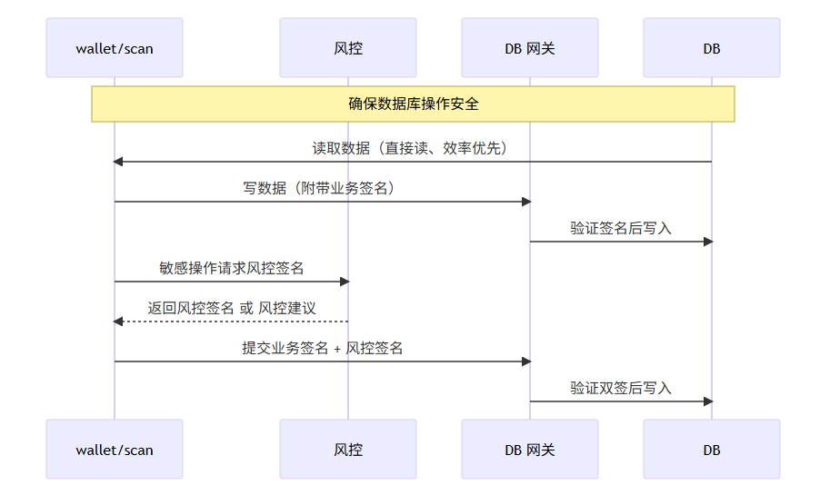
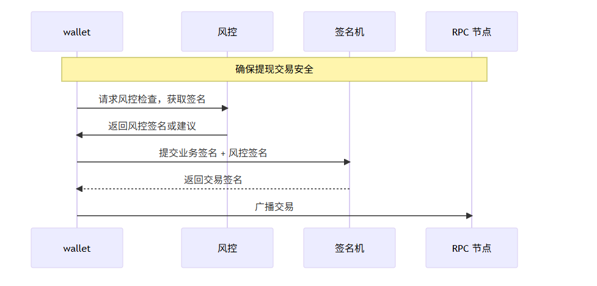
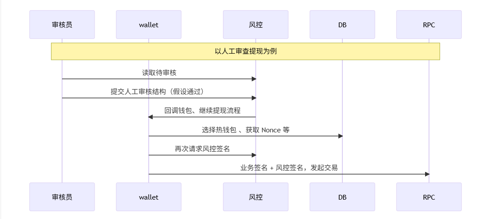
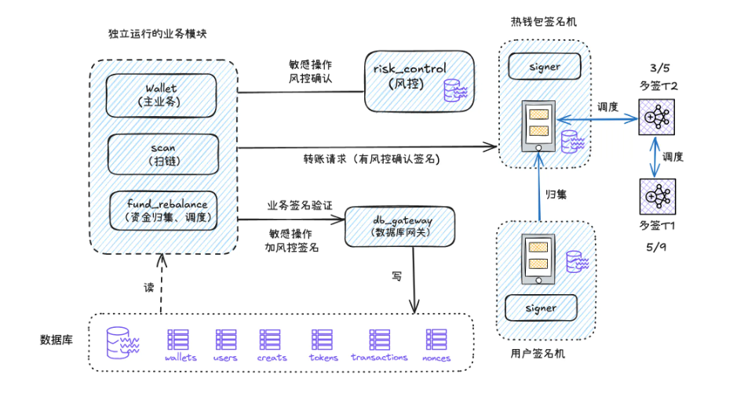

# Risk Control System Design

## I. Why Risk Control Matters

A well-designed exchange wallet system is like a bank. Without proper safety checks, bad actors could:

- **Steal user assets** (theft)
- **Commit fraud** (false transfers)
- **Launder money** (compliance violation)
- **Conduct insider attacks** (internal malfeasance)

The risk control system acts as a "security guardian," protecting user assets while minimizing disruption to legitimate operations.

---

## II. Architecture Update: Introducing the DB Gateway

### Original Problem

In earlier designs, both `wallet` and `scan` modules directly read/write the business database, creating security gaps. This is like letting any employee directly modify the ledger without oversight.

### Solution: Database Gateway

We introduce a **DB Gateway** (database gatekeeper) to centrally control all data writes:



**Flow**:

- **Read operations**: Direct database access (efficiency priority)
- **Normal writes**: Require business signature verification via DB Gateway
- **Sensitive writes**: Require dual signatures (business + risk control)

The DB Gateway is independently deployed and only accessible from internal networks, reducing database tampering risks.

---

## III. Three-Tier Database Permission Model

Like hospital access levels, we have three permission tiers:

| Level                  | Type                        | Requirements                       | Examples                                    |
| ---------------------- | --------------------------- | ---------------------------------- | ------------------------------------------- |
| 🟢 **Read-Only**       | Direct access               | None                               | Query blocks, transactions, user data       |
| 🟡 **Normal Write**    | Business signature required | Verified by DB Gateway             | Block records, transaction logs             |
| 🔴 **Sensitive Write** | Dual signature required     | Business + Risk control signatures | Withdrawals, ledger (credits) modifications |

**Sensitive tables**:

- `withdraws` (withdrawal records)
- `credits` (ledger/fund flow)

---

## IV. Complete Data Flow Architecture

**Read data**: Direct → efficiency priority
**Write data** (non-sensitive): Append business signature → DB Gateway validates → write
**Sensitive operations**: Request risk control evaluation → receive risk control signature → append business signature → DB Gateway validates dual signatures → write

---

## V. Risk Control System Design

### Core Rules

The risk control system acts like a "security director" enforcing:

#### 1. Account Address Screening

- Check against blacklist
- Detect sanctions or violations
- Immediately freeze or reject if flagged

#### 2. Transaction Monitoring

- Limit single withdrawal amount (based on KYC level)
- Limit daily withdrawal frequency
- Restrict new device/address withdrawals (prevent "deposit-then-immediately-withdraw")
- Large transactions → manual review

### Three Core Tables

**Risk Address Table (`address_risk_list`)**

- Manages blacklist addresses
- Quick risk assessment

**Risk Assessment Records (`risk_assessments`)**

- Records evaluation results
- Maintains audit trail
- Contains risk reasons and decisions

**Manual Review Records (`risk_manual_reviews`)**

- Documents reviewer actions
- Records decision timestamp
- Enables future accountability

---

## VI. Risk Assessment Record Schema

The **risk_assessments** table is the core of risk control:

| Field                  | Type     | Description                                 |
| ---------------------- | -------- | ------------------------------------------- |
| id                     | INTEGER  | Primary key                                 |
| operation_id           | TEXT     | UUID for this operation (unique, traceable) |
| table_name             | TEXT     | Business table (withdraws/credits)          |
| record_id              | INTEGER  | Bi-directional link to business record      |
| action                 | TEXT     | Operation type: insert/update/delete        |
| user_id                | INTEGER  | Associated user ID                          |
| operation_data         | JSON     | Original operation data                     |
| suggest_operation_data | JSON     | Risk control's suggested modifications      |
| suggest_reason         | TEXT     | Reason for suggestion                       |
| risk_level             | TEXT     | low / medium / high / critical              |
| decision               | TEXT     | auto_approve / manual_review / deny         |
| approval_status        | TEXT     | pending / approved / rejected               |
| reasons                | JSON     | Array of risk factors                       |
| risk_signature         | TEXT     | Risk control's signature                    |
| expires_at             | DATETIME | Signature expiration                        |
| created_at             | DATETIME | Creation timestamp                          |
| updated_at             | DATETIME | Update timestamp                            |

**Key fields**:

- **operation_id**: UUID generated by business layer—each operation is trackable for auditing
- **operation_data**: Captures original data for immutable records
- **suggest_operation_data**: Risk control recommendations (e.g., freeze deposits)
- **risk_signature**: Risk control's signature over (operation_id, action, operation_data, timestamp)

---

## VII. Dual Signature Mechanism

### Why Signatures?

Signatures are like "fingerprinted contracts"—forgery-proof.

### Withdrawal Security Flow



**Process**:

1. **Wallet requests risk control** → "Is this 100 USDC withdrawal safe?"
2. **Risk control returns signature** → "Approved, here's my signature"
3. **Wallet adds business signature** → "I also approve, dual authorization"
4. **Signing machine verifies & broadcasts** → "Signatures verified, transaction live"

### Preventing Signature Replay Attacks

**Risk**: Could an attacker intercept a "signature approved" and replay it multiple times?

**Defense**: We embed **operation-level uniqueness**:

```
Signature covers:
  - operation_id (UUID—unique per operation)
  - timestamp (prevents old signatures)
  - action, operation_data
```

#### Used Operation IDs Table

| Field        | Type     | Description               |
| ------------ | -------- | ------------------------- |
| id           | INTEGER  | Primary key               |
| operation_id | TEXT     | UUID (unique)             |
| used_at      | BIGINT   | Usage timestamp (ms)      |
| expires_at   | BIGINT   | Expiration timestamp (ms) |
| created_at   | DATETIME | Record creation           |

**How it works**:

- Each signature has a 1-minute validity window
- DB Gateway maintains `used_operation_ids` table
- Same operation_id can only be used once
- Replay attempts are rejected

---

## VIII. Signature Algorithm

We use **Ed25519** curve (same as Solana's signature scheme) because:

- Fast signing and verification
- Industry standard for high-frequency operations
- Compact signature size

Signature payload includes:

- `operation_id` (prevents replays)
- `timestamp` (prevents old signatures)
- `action`, `operation_data` (prevents tampering)

---

## IX. Manual Review Process

When risk control cannot auto-decide, human judgment is required.



**Flow**:

1. **Reviewer sees pending withdrawal** → Checks user info and transaction details
2. **Makes decision (assuming approval)** → Clicks "Approve" in system
3. **System notifies wallet via callback** → "Manual review passed, continue"
4. **Wallet resumes withdrawal** → Selects hot wallet, gets nonce
5. **Re-requests risk control signature** → Gets new risk signature (with operation_id)
6. **Final submission** → Business signature + risk control signature → initiates transaction

**Why callback over polling?**

- Real-time notifications
- No repeated reviews of same withdrawal
- Business layer immediately aware of decision

**Database link**:
Add `operation_id` field to `withdraws` table to link manual review decisions.

---

## X. Module Responsibilities

| Module           | Role                                              | Permissions               |
| ---------------- | ------------------------------------------------- | ------------------------- |
| **wallet/scan**  | Business logic + business signature               | Initiate requests         |
| **risk_control** | Risk assessment + risk signature                  | Evaluate & approve/deny   |
| **db_gateway**   | DB operations + dual signature verification       | Gate all writes           |
| **signer**       | Transaction signing + dual signature verification | Generate final signatures |

---

## XI. Security Guarantees

**Even if business system is compromised:**

| Scenario                 | Defense                         | Result  |
| ------------------------ | ------------------------------- | ------- |
| Business module hijacked | Requires risk control signature | ✅ Safe |
| Database attacked        | DB Gateway verifies all writes  | ✅ Safe |
| Signatures replayed      | operation_id prevents reuse     | ✅ Safe |
| Large withdrawal risk    | Escalated to manual review      | ✅ Safe |

**Performance vs. Security Balance**:

```
Regular data queries → Direct database (fast)
                ↓
         Sensitive operations → Dual signature verification (secure)
```

---

## XII. Data Flow: Read vs. Write

### Read Operations

- Direct database access
- No gateway overhead
- Efficiency priority

### Write Operations

**Non-sensitive** (blocks, transactions):

```
Business Module
    ↓
Append business signature
    ↓
DB Gateway validates
    ↓
Database write
```

**Sensitive** (withdrawals, ledger):

```
Business Module
    ↓
Request risk control evaluation
    ↓
Risk control returns risk signature
    ↓
Append business signature
    ↓
DB Gateway validates both signatures
    ↓
Database write
```

---

## XIII. Complete System Architecture



**Components**:

- **Independent business modules** (wallet, scan, fund_rebalance) with business signatures
- **Risk control module** with separate database and risk signatures
- **Hot wallet signing machine** with independent database (multiple signers for distribution)
- **User wallet signing machine** with independent database (different signers for distribution)
- **DB Gateway** controlling all sensitive data writes
- **Central database** with business tables (wallets, users, credits, tokens, transactions, nonces)

---

## XIV. Future Optimization Directions

- **Configurable risk rules**: Adjust parameters based on historical data
- **Full-stack audit trail**: Complete traceability for every operation
- **Anomaly detection**: Machine learning to identify suspicious patterns
- **Async notifications**: Message queues for scalable notifications
- **Dynamic thresholds**: Adjust limits based on user behavior

---

## XV. Best Practices Summary

A good risk control system should be:

1. **Security First** 🔒

   - Multi-layered defense
   - No shortcuts for bad actors

2. **Clear Process** 📋

   - Every operation logged
   - Complete audit trail

3. **Human + Machine** 🤖

   - Automation for routine cases
   - Human review for complex cases

4. **User Friendly** 😊
   - Protect assets without friction
   - Legitimate users unimpeded

---

## XVI. Implementation Checklist

- [ ] Deploy DB Gateway as independent service
- [ ] Add `wallet_type`, `operation_id` fields to relevant tables
- [ ] Implement Ed25519 signing in risk control module
- [ ] Create `risk_assessments` table with complete schema
- [ ] Create `used_operation_ids` table for replay prevention
- [ ] Implement dual signature verification in DB Gateway
- [ ] Implement callback mechanism for manual review
- [ ] Add `address_risk_list` and `risk_manual_reviews` tables
- [ ] Test signature replay prevention under load
- [ ] Implement operation_id lifecycle management

---

## References

- Signature Algorithm: [Ed25519 Specification](https://ed25519.cr.yp.to/)
- Database Security: [Principle of Least Privilege](https://en.wikipedia.org/wiki/Principle_of_least_privilege)
