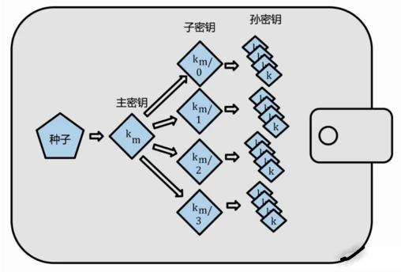
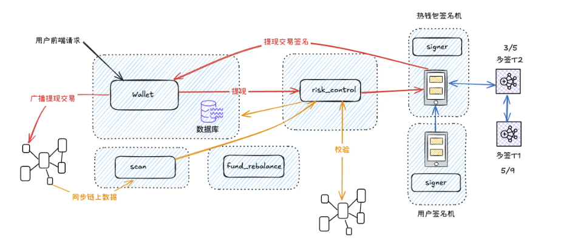

# 签名机设计与账号生成

## 第一部分：钱包基础概念

### 什么是数字钱包？

在区块链世界里，钱包不是存钱的，而是**管理私钥的工具**。你的数字资产都存在链上，只有拥有私钥才能操控这些资产。

```
私钥 → 椭圆曲线算法 → 公钥 → 哈希函数 → 地址
（秘密）          （单向推导）    （可以公开）
```

**核心原则：** 私钥生成公钥，公钥生成地址，这两步都是单向的，无法反推。

### 创建账号的第一步：生成私钥

私钥本质上是从 1 到 2^256 之间选一个数字。关键是这个数字必须足够**随机**和**不可预测**。

比喻：就像掷硬币 256 次，每次正面记为 1、反面记为 0，最后得到的 256 位二进制数就是私钥。

---

## 第二部分：HD 钱包与分层派生（BIP32）

### 问题：为什么需要 HD 钱包？

最初的比特币钱包很笨——如果你想要多个账号，就得生成一堆独立的私钥，每个都要单独备份。这太麻烦了！

### 解决方案：一个种子生成无限私钥

**BIP32** 提出了分层确定性钱包的概念：**用一个随机种子，通过特定算法可以派生出无限多个私钥**。



**关键优势：**

- 只需备份一个种子，就能恢复所有账号
- 派生过程是确定性的（相同输入 → 相同输出）
- 派生是单向的（子密钥无法推出父密钥）

### 派生的两种方式

| 方式     | 索引范围       | 特点                   |
| -------- | -------------- | ---------------------- |
| 常规派生 | 0 ～ 2^31-1    | 可用公钥派生           |
| 强化派生 | 2^31 ～ 2^32-1 | 需要私钥派生（更安全） |

---

## 第三部分：路径规范与多币种支持（BIP44）

### 路径表示法

派生出来的密钥用树形路径表示，用斜杠 `/` 分隔层级：

```
m/0/1/2  （m 是主私钥，之后是一层层的推导）
M/0/1/2  （M 是主公钥）
```

### BIP44 标准路径

**问题：** 不同的钱包用不同的路径标准，容易混乱。

**BIP44 规范：** 定义了统一的 5 层树状结构

```
m / purpose' / coin' / account' / change / address_index
```

**各部分含义：**

| 部分          | 含义     | 示例                   |
| ------------- | -------- | ---------------------- |
| m             | 主私钥   | 固定                   |
| purpose'      | 目的     | 固定为 44'             |
| coin'         | 币种     | 0=比特币，60=以太坊    |
| account'      | 账户索引 | 0,1,2...               |
| change        | 地址类型 | 0=收款地址，1=找零地址 |
| address_index | 地址序号 | 0,1,2...               |

### 以太坊实际路径

```
m/44'/60'/0'/0/0
   ↓  ↓  ↓ ↓ ↓
  固定 以太坊 账户0 收款地址 第0个地址

m/44'/60'/0'/0/1
   ↓  ↓  ↓ ↓ ↓
  固定 以太坊 账户0 收款地址 第1个地址
```

---

## 第四部分：助记词备份（BIP39）

### 问题：如何安全备份种子？

随机种子是一长串十六进制数，难以记住和备份：

```
090ABCB3A6e1400e9345bC60c78a8BE7  ← 这样备份太麻烦了
```

### 解决方案：用 12 个单词代替

**BIP39** 把随机种子转换成 12 或 24 个常见英文单词：

```
candy maple cake sugar pudding cream honey rich
smooth crumble sweet treat
```

**转换过程：**

1. 生成 128 位随机数
2. 计算校验位（4 位）
3. 分割成 12 个 11 位的二进制数
4. 每个数字对应 BIP39 单词表中的一个单词

### 从助记词恢复账号

助记词 + 密码 → 通过 PBKDF2 运算 → 种子 → 派生私钥 → 地址

**关键：** 相同的助记词+密码，总是生成相同的账号。不同的密码生成不同的账号。

---

## 第五部分：交易所钱包系统架构

### 为什么需要系统设计？

交易所面临的挑战：

- 安全性第一（要保护用户资产）
- 高并发（大量用户同时注册、充值）
- 可扩展（要支持多条公链）

### 系统分层架构



**核心原则：内网隔离，分层治理**

| 模块                        | 职责                             | 位置       |
| --------------------------- | -------------------------------- | ---------- |
| **Wallet** 主模块           | 处理业务逻辑、管理用户、调度地址 | 可公网访问 |
| **Signer** 签名机           | 生成私钥、保管私钥、签名交易     | 内网隔离   |
| **Scan** 充值扫描           | 监听链上交易，匹配用户充值       | 内网       |
| **Risk Control** 风控       | 检测异常交易                     | 内网       |
| **Fund Rebalance** 资金归集 | 汇总到冷钱包或多签钱包           | 内网       |

### 用户注册流程

```
用户请求地址
    ↓
Wallet 查询数据库
    ↓ (没有地址)
向 Signer 请求生成
    ↓
Signer 派生新地址
    ↓
返回地址给 Wallet
    ↓
Wallet 保存到数据库
    ↓
返回给用户
```

**关键细节：**

- Wallet 主模块只知道地址，不知道私钥
- 私钥始终保存在 Signer 签名机
- Signer 只接受来自 Wallet 的内网请求（防火墙保护）

### 数据库设计

#### Wallet 主模块数据库

**用户表：** 记录用户基本信息（用户名、邮箱、密码、KYC 状态等）

**钱包表：** 记录用户的地址信息

| 字段       | 说明                            |
| ---------- | ------------------------------- |
| user_id    | 用户 ID                         |
| address    | 用户钱包地址                    |
| device     | 来自哪个 Signer                 |
| path       | 派生路径（如 m/44'/60'/0'/0/0） |
| chain_type | 币种（evm、btc、solana）        |

#### Signer 签名机数据库

| 字段        | 说明           |
| ----------- | -------------- |
| address     | 生成的地址     |
| path        | 派生路径       |
| index_value | 路径中的索引值 |
| chain_type  | 币种           |

**安全提示：** 两个数据库中都**不存储私钥**，只存派生路径。私钥永不落盘。

---

## 第六部分：签名机的安全设计

### 密码保护

启动签名机时，运营人员需要输入密码：

```
环境变量: 助记词 (存储在服务器配置中)
+
运营人员输入: 密码 (隐藏输入，显示为*)
        ↓
生成种子 → 派生私钥 → 生成地址
```

**安全性提升：**

- 即使黑客获得助记词，没有密码也无法生成私钥
- 隐藏输入防止密码被记录在终端历史中
- 每次启动时验证第一个地址是否正确，确保密码没输错

### 地址生成流程

```
POST /api/signer/create?chainType=evm
    ↓
根据当前最大索引生成下一个路径
    ↓
m/44'/60'/0'/0/{nextIndex}
    ↓
用助记词 + 密码 → 生成种子
    ↓
从种子派生该路径的私钥
    ↓
私钥生成公钥和地址
    ↓
保存地址、路径、索引到数据库
    ↓
返回地址（仅地址，不返回私钥）
```

---

## 总结：从种子到地址的完整流程

```
1. 生成助记词 (BIP39)
   ↓
   candy maple cake sugar ... (12个单词)

2. 助记词 + 密码 → 种子 (Key Stretching)
   ↓
   一个512位的随机数

3. 种子 → 主私钥/主公钥 (BIP32)
   ↓
   HMAC-SHA512运算

4. 分层派生 (BIP32)
   ↓
   m/44'/60'/0'/0/0 → 第一个账号
   m/44'/60'/0'/0/1 → 第二个账号
   ...

5. 私钥 → 公钥 → 地址 (椭圆曲线 + 哈希)
   ↓
   最终得到可以接收转账的区块链地址
```

---

## 为什么这样设计？

| 设计                      | 解决的问题                                             |
| ------------------------- | ------------------------------------------------------ |
| **HD 钱包 (BIP32/BIP39)** | 无需备份一堆私钥，只需保管一个助记词                   |
| **标准路径 (BIP44)**      | 统一规范，不同钱包可以互相恢复账号                     |
| **Wallet-Signer 分离**    | 私钥与业务逻辑隔离，即使业务端被黑客攻击也无法盗取私钥 |
| **内网隔离**              | Signer 只接受内网请求，防止外网直接攻击                |
| **助记词+密码**           | 双因素保护，增强安全性                                 |

---

## 常见问题

**Q: 丢失助记词怎么办？**
A: 无法恢复。这就是为什么要离线冷备份，建议保存在物理安全的地方（比如保险箱）。

**Q: 一个人可以有多个账户吗？**
A: 可以。通过改变 account' 或 address_index 就能生成不同账户。都由同一个助记词控制。

**Q: 比特币和以太坊的地址可以混用吗？**
A: 不能。coin_type 不同（比特币是 0，以太坊是 60），派生的私钥也不同。生成的地址格式也不兼容。

**Q: 交易所需要备份多少助记词？**
A: 一个就够了。但通常会做多份冷备份（分开保管），以防单点故障。
